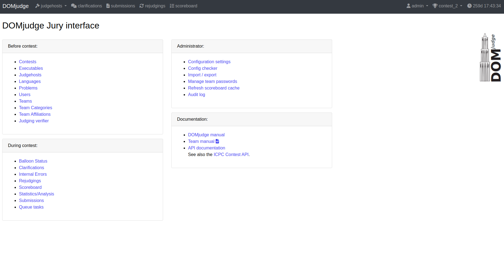
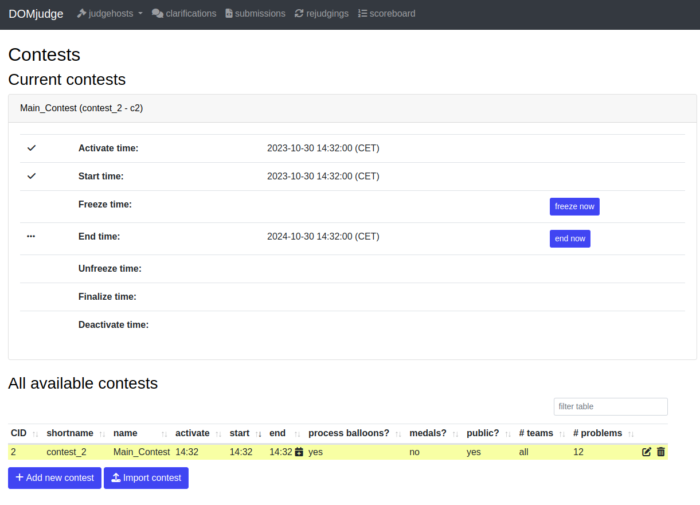
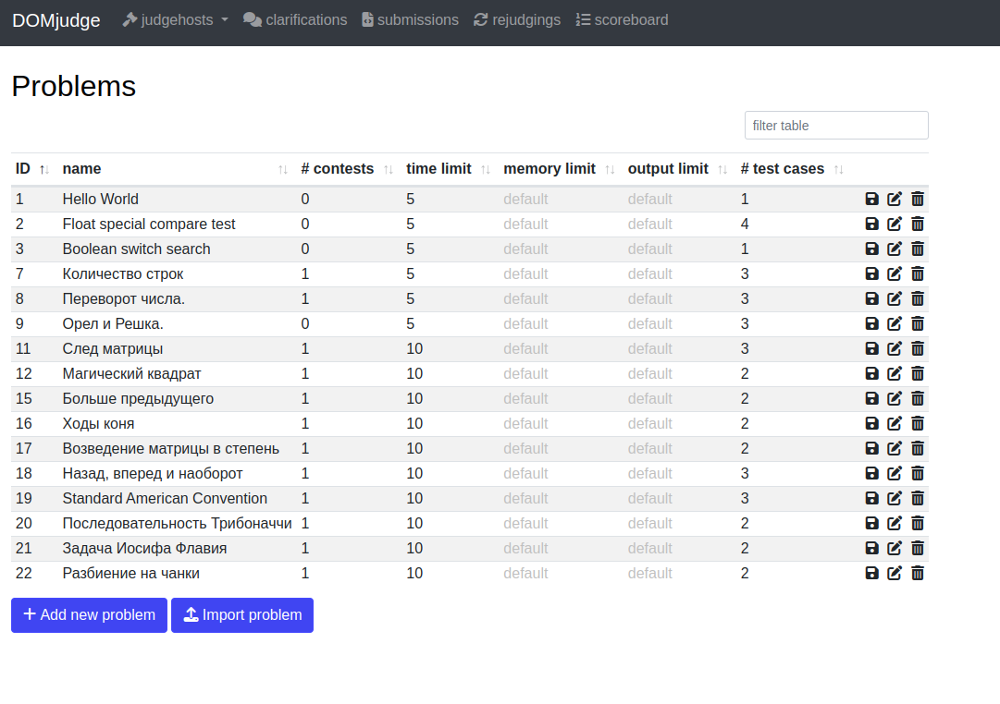
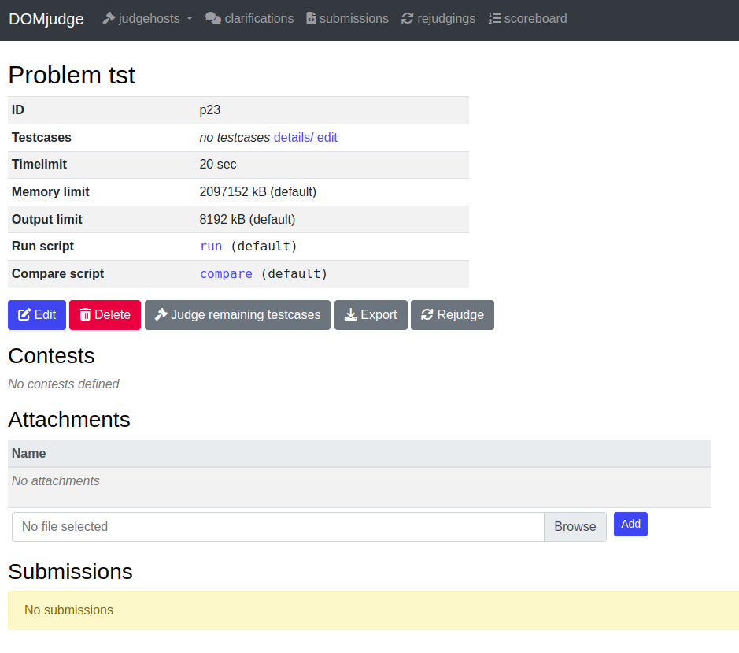
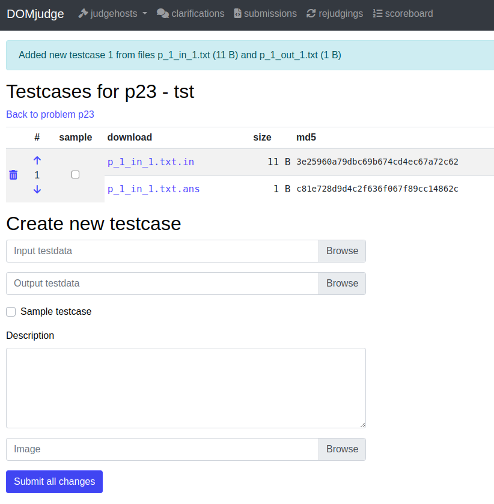
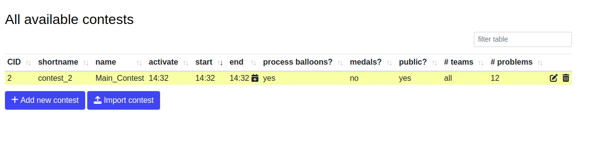
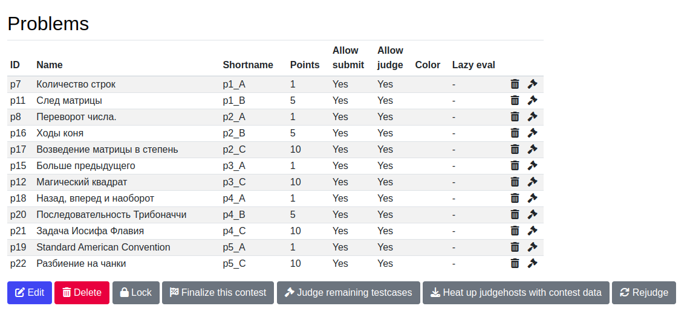
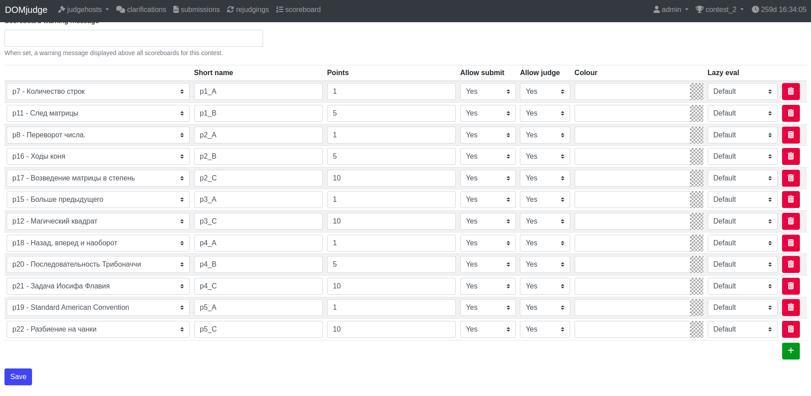

# CompetitiveBot

## Описание проекта

CompetitiveBot - это телеграм бот, реализующий возможности соревновательной системы по программированию на основе сервиса DOMjudge. CompetitiveBot предоставляет список задач по программированию трех уровней сложности. Решения принимаются на нескольких доступных языках программирования, благодаря чему вы можете проверить свои навыки в каждом из них. Также бот выводит рейтинговую таблицу, где вы можете увидеть свое место среди других пользователей. Это поможет вам отслеживать свой прогресс и стремиться к новым результатам.


CompetitiveBot объединяет в себе интерфейс в виде телеграм-бота и серверную часть: веб-интерфейс для работы с данными (domserver), сервер судьи, необходимый для оценки и тестирования решений пользователей (judgehost) и базу данных (mariadb)

При напиcании сервиса были использованы python3, Ubuntu 20.04.

## Руководство по установке и настройке сервиса CompetitiveBot

### Установка необходимых контейнеров и исходного кода проекта.

При установке используются образы docker и код проекта из github.

1. Установка docker.
\
Руководство по установке docker вы можете найти на [странице официальной документации](https://docs.docker.com/engine/install/ubuntu/).

2. Установка контейнера базы данных.
\
MariaDB container:

```
sudo docker run -it --name dj-mariadb -e MYSQL_ROOT_PASSWORD=rootpw -e MYSQL_USER=domjudge -e MYSQL_PASSWORD=djpw -e MYSQL_DATABASE=domjudge -p 13306:3306 mariadb --max-connections=1000
```

3. Установка контейнера сервера.
\
DOMserver container:

```
docker run --link dj-mariadb:mariadb -it -e MYSQL_HOST=mariadb -e MYSQL_USER=domjudge -e MYSQL_DATABASE=domjudge -e MYSQL_PASSWORD=djpw -e MYSQL_ROOT_PASSWORD=rootpw -p 12345:80 --name domserver domjudge/domserver:latest
```

После установки DOMserver, в консоль будут выведены пароли для пользователей admin и judgehost, их необходимо сохранить, будьте внимательны.

Так же их можно будет найти используя:

```
docker exec -it domserver cat /opt/domjudge/domserver/etc/initial_admin_password.secret
docker exec -it domserver cat /opt/domjudge/domserver/etc/restapi.secret
```

4. Установка контейнера судьи.
\
В ключе JUDGEDAEMON_PASSWORD необходимо будет указать пароль judgehost.

Judgehost container:

```
sudo docker run -itd --privileged -v /sys/fs/cgroup:/sys/fs/cgroup:ro --name judgehost-0 --link domserver:domserver --hostname judgedaemon-0 -e DAEMON_ID=0 -e CONTAINER_TIMEZONE=Asia/Shanghai -e JUDGEDAEMON_PASSWORD= domjudge/judgehost:8.2.1
```

5. Клонирование проекта CompetitiveBot из репозитория.

```
git clone https://github.com/pococonut/CompetitiveBot.git
```

6. Создание виртуального окружения.
\
В среде PyCharm:

```
Settings -> Project: CompetitiveBot -> Python Interpreter -> Python 3.x
```

7. Установка необходимых библиотек.
\
Откройте консоль в корневой папке проекта и выполните команду:
```
pip install -r requirements.txt
```

8. Создание файла config.py 
\
Для правильной работы программы и ее взаимодействия с другими сервисами, необходимо в корневой папке проекта в файле config.py указать конфигурационные данные для приложения.

Пример файла config.py:

```
import requests
from pydantic.v1 import BaseSettings


class Settings(BaseSettings):
    api: str = "TOKEN"
    admin_username = "admin" # Данное поле можно оставить без изменений, если вы не указывали другого имени для пользователя admin
    admin_password = "ADMIN_PASSWORD"


settings = Settings()


def admin_authorization(uname, passw):
    session = requests.Session()
    session.auth = (uname, passw)
    return session
```

9. Запуск контейнеров.

```
docker start dj-mariadb
docker start domserver
docker start judgehost-0
```

После правильной установки, вам будет доступен веб-интерфейс DOMjudge по адресу http://localhost:12345.
\
Для входа нужно будет указать имя и пароль пользователя admin.



### Заполнение базы данных сервиса.

Для корректной работы с CompetitiveBot, вам будет необходимо добавить данные в определенном формате.

1. Создание нового соревнования (Contests).
\
По умолчанию будет создано тестовое соревнование с тестовыми задачами. Для правильного отображения задач нужно либо удалить задачи в тестовом соревновании, либо создать новое соревнование. После создания соревнования в  него необходимо добавить задачи. Рассмотрим вариант создания нового соревнования.

Во вкладке Contests выберите Add new contest.



Укажите параметры Shortname, Name, Start time, End time.

После добавления соревнования, его id будет равен 2, если вы не создавали  больше соревнований. CompetitiveBot использует id соревнования равным 2, если вы хотите использовать другое соревнование, укажите его id в файле commands/url_requests.py в параметре ```CONTEST_ID = "2"```

2. Создание задач.
\
Внимание! Для корректного отображения задачи в телеграм боте, необходимо создавать pdf-файл с описанием в определенном формате. Примеры готовых задач в формате docx и pdf, а так же входных-выходных тестовых данных в формате txt вы сможете найти [по этой ссылке](https://drive.google.com/drive/folders/13qsFPx9tzbNi--wTh5e02KzthBUE0ovq).
\
Телеграм бот принимает задачи трех уровней сложности - A, B, C
\
p_1_A.pdf - описание задачи, 1 - номер задачи, A - уровень задачи.
\
p_1_in_1.txt - первые входные тестовые данные для задачи p_1_A.
\
p_1_out_1.txt - первые выходные тестовые данные для задачи p_1_A.
\
p_1_in_2.txt - вторые входные тестовые данные для задачи p_1_A.
\
p_1_out_2.txt - вторые выходные тестовые данные для задачи p_1_A.
\
И так далее.
\
\
Для создания задачи перейдите во вкладку Problems и выберите Add new problem.



Введите название задачи (Name)
\
Ограничение по времени на запуск и исполнение программы - решения задачи (Timelimit)
\
Описание задачи в виде pdf-файла (Problem text)
\
\
После добавления задачи, нужно добавить входные-выходные тестовые данные для задачи. 
\
В параметре Testcases нажмите details/ edit



Добавте тестовые данные в формате txt



3. Добавление задач в соревнование.

После того как вы создали соревнование и добавили несколько задач с тестовыми данными, необходимо добавить задачи в соревнование.
\
\
Перейдите во вкладку Contests и внизу страницы в All available contests нажмите на соревнование, в которое вы хотите добавить задачи.



Далее пролистайте вниз страницы и в Problems нажмите на кнопку Edit.



Внизу страницы нажмите на знак "+" для добавления задачи в соревнование.



В первой колонке выберите задачу которую хотите добавить. Далее необходимо указать короткое название задачи (Short name).
\
\
Внимание! В CompetitiveBot для разделения задач по уровню сложности исользуется короткое название задачи (Short name). Необходимо дать для задачи короткое название в форате:
\
p1_A - Легкая задача
\
p1_B - Средняя задача
\
p1_C - Сложная задача

где p - сокращение от problem, 1  - номер задачи в категории, A/B/C - уровень задачи.
\
\
Далее укажите баллы за задачу (Points)
\
\
После нажмите кнопку Save для добавления задачи в соревнование.

### Запуск телеграм бота

После правильной установки и настройки, сервис будет готов к использованию. Перейдите в корневую папку проекта и запустите приложение.

```
python3 main.py
```
